# Architecture Intro

* Survey Moonbear is a Ruby Web application.
* During survey-taking, browser javascript acts like an SPA (single page application).
  * Next page button just changes the view in javascript.
  * Only when respondent submits the survey at the end, browser javascript POSTs the filled survey to App.

