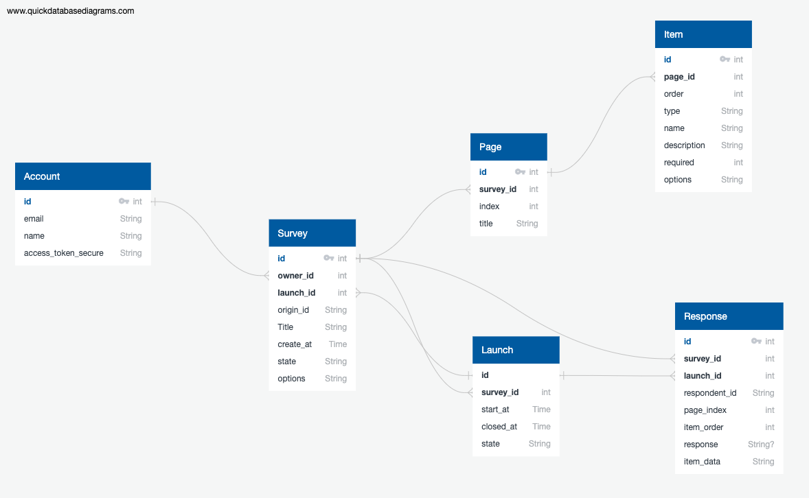

# Infrastructure

#### File store service (Google Drive)

* Stores spreadsheets
* Each launch store the survey in database. Delete the old one.

#### Spreadsheet service (Google Sheets)

* Stated spreadsheet that is a Template for all new surveys
  * (gets copied to a new spreadsheet when user ‘creates’ a new survey)
* Each ‘survey’ is represented by a single spreadsheet

#### Database (Postgres on Heroku)

* How is the survey stored on database tables?
  * [_DETAILS_](https://app.quickdatabasediagrams.com/#/d/ksihWW)
  * `Account`: Login with google account
  * `Survey`: a Account could create many survey
  * `Launch`: if owner want to edit the survey, close the survey first and launch again after edited.
  * `Page`: different pages in a survey
  * `Item`: item is the question in different page in different survey
  * `Response`: each response is replied for each question(item)
* Database will only store the latest lauch of survey, not every version.
* We store not only the responses to each question, we also store a copy of the survey structure for each respondent
* [Prototype Design Pattern](https://drive.google.com/file/d/1VCzd8p9vSyhY-vFI_tyg-KJhg5Oxs9kH/view?usp=sharing)
* Data Schema 

#### Queuing (AWS SQS)

* situation: browser javascript POSTs submission to App; App writes to database
* problem: respondents submitting surveys caused heavy DB writes, which caused application to hang (> 50 writes per survey response) with hundreds of simultaneous submissions, even with Postgres multisert
* solution: browser javascript POSTs survey submission to App; App queues the submission information on AWS SQS; Background worker (shoryuken?) reads from SQS queue and systematically writes to DB.
