# Google Drive/Calendar API

It uses `google-api-client` package which is [deprecated](https://github.com/googleapis/google-api-ruby-client/blob/master/google-api-client/OVERVIEW.md). If it is not working, please refer to the [`google-api-ruby-client`](https://github.com/googleapis/google-api-ruby-client).

### Step1: A GCP project with the API enabled

1. [create GCP project](https://developers.google.com/workspace/guides/create-project#create_a_new_google_cloud_platform_gcp_project)
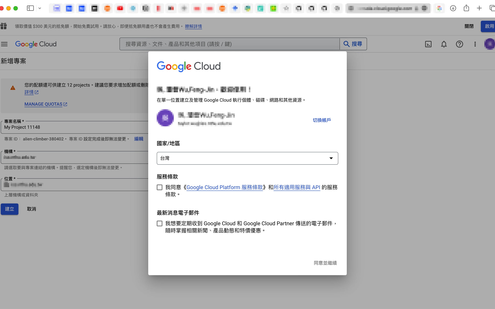 （Should accept the Service Rule when first time using This）
1. [enable Google Drive API, Google Sheets API and Google Calendar API](https://developers.google.com/workspace/guides/create-project#enable-api)
2. Button of "Enable APIs and Services" is hard to find
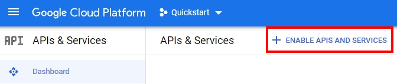
1. Click on "Enable"(if  Enable is will show MANAGE)
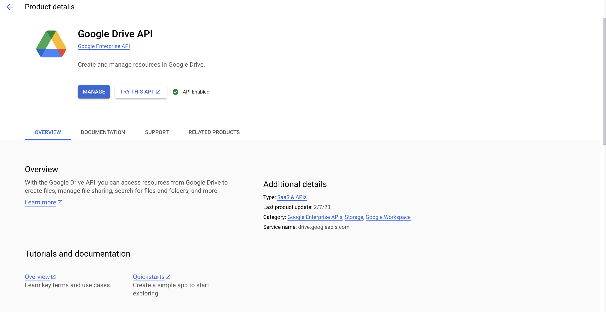

### Step2: Create authorization credentials for a "Web application"

1. [Configure the OAuth consent screen](https://developers.google.com/workspace/guides/create-credentials#configure_the_oauth_consent_screen)
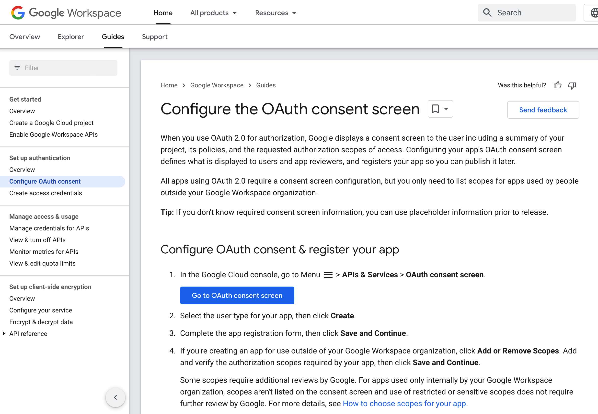
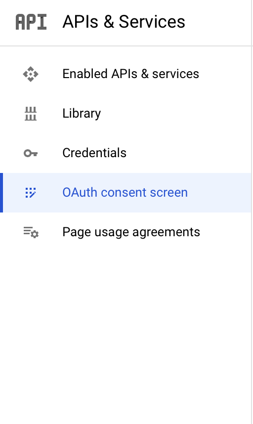
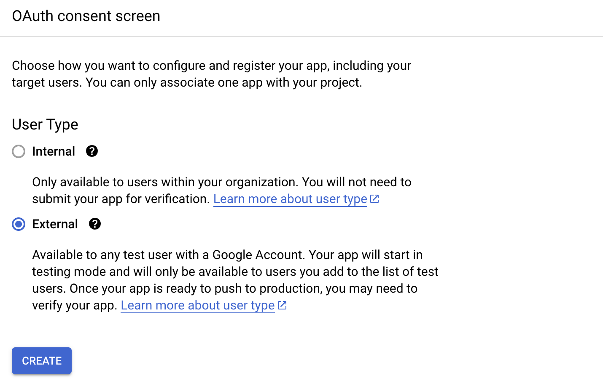

2. [Create a OAuth client ID credential](https://developers.google.com/workspace/guides/create-credentials#create_a_oauth_client_id_credential)
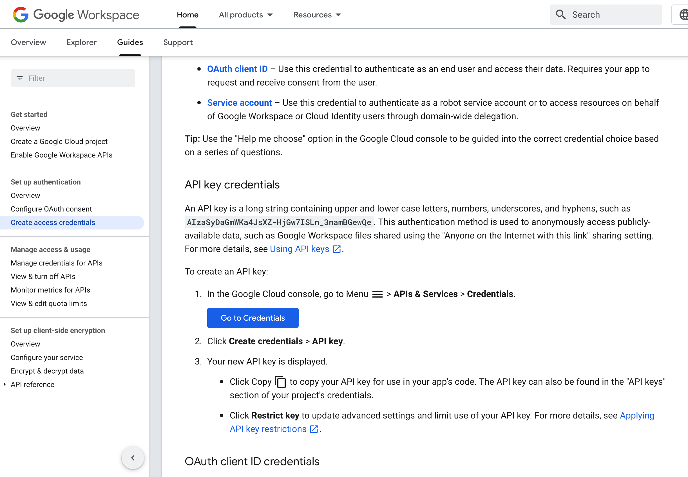

1. The type of project/application's credential choose **[web application](https://developers.google.com/workspace/guides/create-credentials)**.
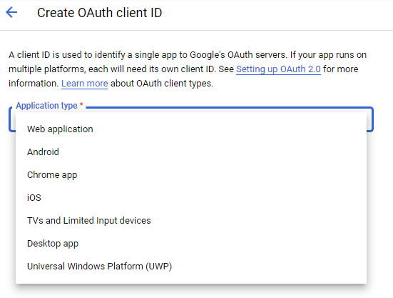
### Step3: Add following three redirect URI in created authorization credentials

* For creating a staging app: 

  `https://<appname-staging>.herokuapp.com/account/login/google_callback`
* For local development: 
  `http://localhost:9090/account/login/google_callback`

  `http://localhost:9090/survey_list`
* For getting refresh token: 
  `https://developers.google.com/oauthplayground`

### Step4: Get application refresh token
1. go to [oauth play ground](https://developers.google.com/oauthplayground)
2. click setting and check the checkbox:Use your own Oauth credentials
3. copy/paste the Client ID and Client secret from step2
4. select the scopes we used on the left side (in application/controller/app.rb file line 36)

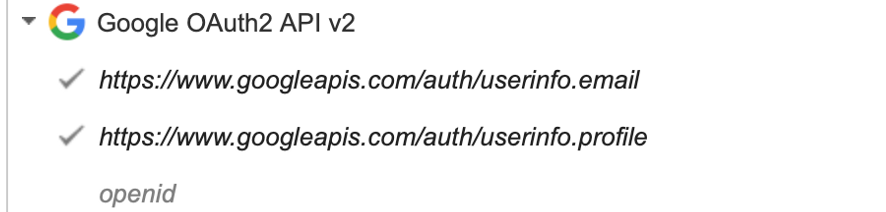
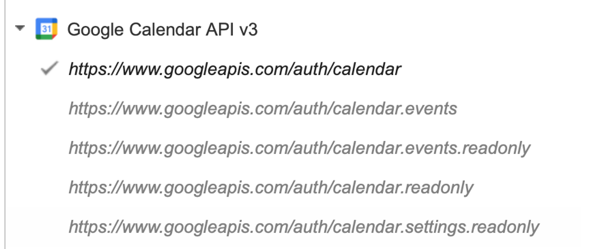
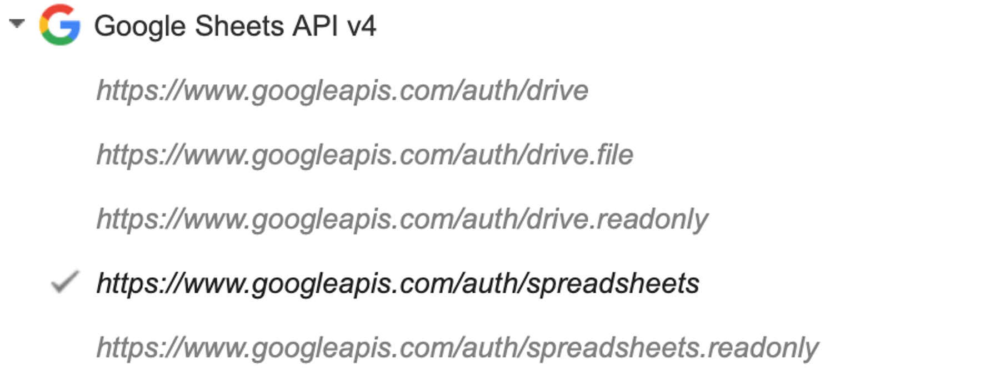

1. click the Authorize APIs
  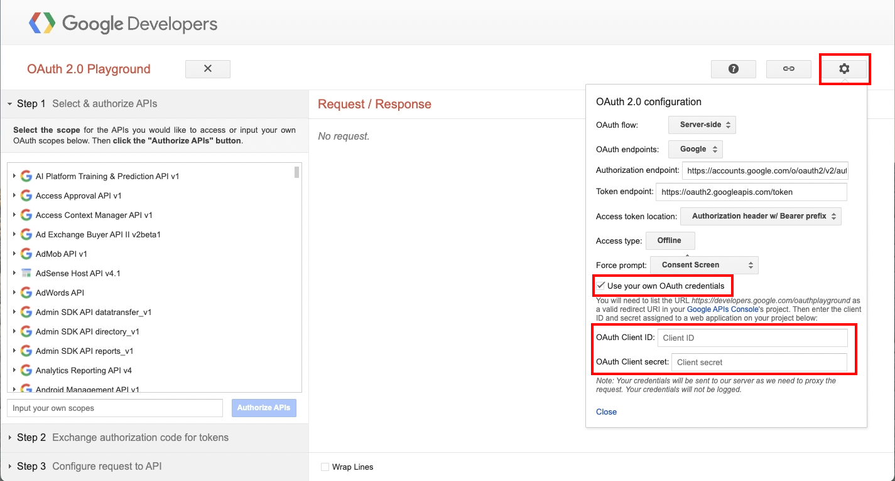
1. It will turn back following screen
2. Click Exchange authorization code for tokens and you will see the refresh token
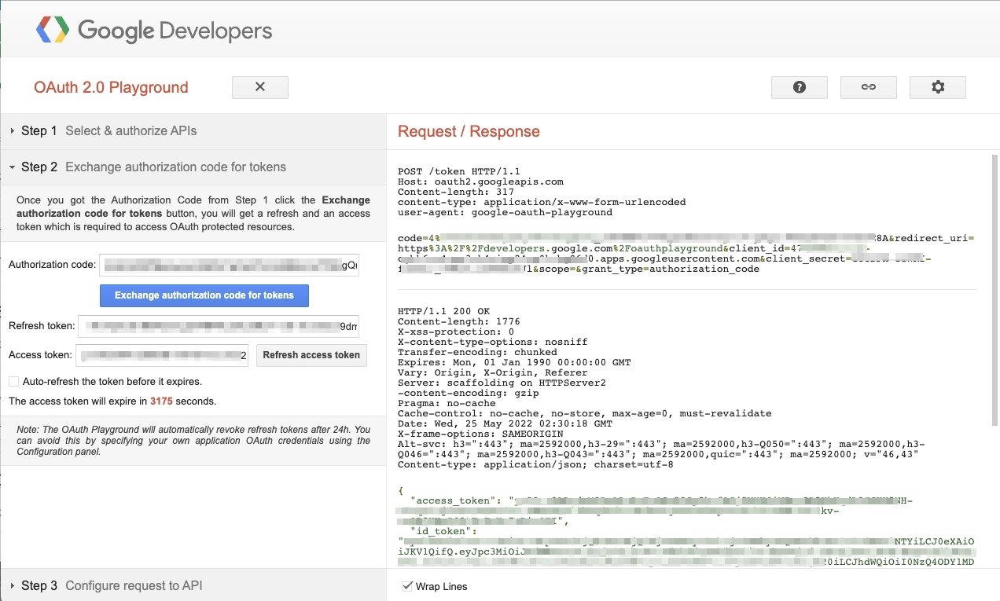

### Step5: get sample file ID
1. Copy sample file from SurveyMoonbear to your develop google account
2. Find the fileID you want to copy (It would return the id in terminal when the quickstart finish. Or find the fileID in the url) 
  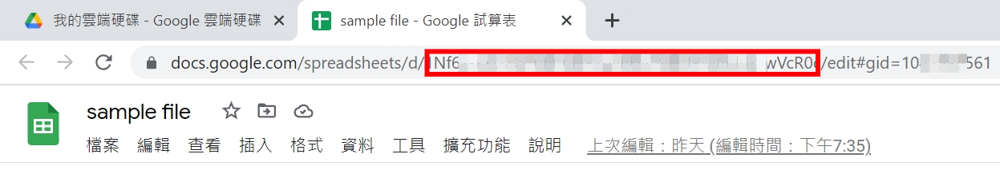

### Step6: Update Secrets file

```
GOOGLE_CLIENT_ID: 
GOOGLE_CLIENT_SECRET: 
REFRESH_TOKEN: 
SAMPLE_FILE_ID: 
```

---
#### [ARCHIVED] Use Quickstart to practice how to get refresh_token
*(follow this when choosing **Desktop application** in authorization credentials)*
1. [Install the Google Client Library](https://developers.google.com/drive/api/v3/quickstart/ruby?hl=en#step\_1\_install_the_google_client_library) `gem install google-api-client`
2. [Set up the sample file](https://developers.google.com/drive/api/v3/quickstart/ruby?hl=en#step\_2\_set_up_the_sample) Create a file named quickstart.rb
3. Download the `credentials.json` from GCP Platform _This file has fixed format. You cannot change it._ 
4. `credentials.json` has your `google client ID` and `google client secret` 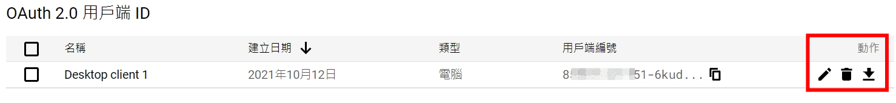
5. Run the sample `ruby quickstart.rb`
6. After typing `ruby quickstart.rb` and linking to the auth page, it would show a code. ==Just copy and paste it in terminal== which you're running. Then, it would write down the _token.yaml_ 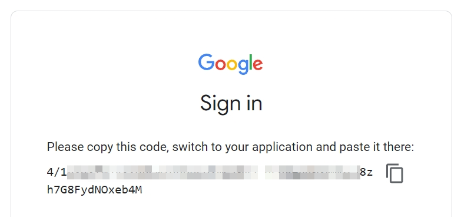
7. **`refresh_token`** is written in the file **`token.yaml`** only one time once it authorizes. **Keep this file** or you need to delete the authorizaion and try quickstart angain.

#### [ARCHIVED] Change the "Scope" in quickstart.rb to get the right access of refresh_token
*(follow this when choosing **Desktop application** in authorization credentials)*
1. In `quickstart.rb`, there is a line setting the scope
  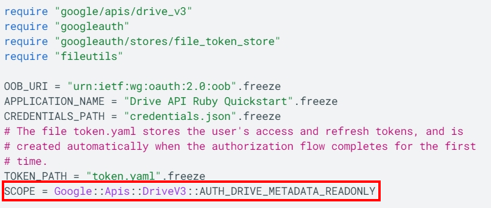
1. different scope has different [access right](https://developers.google.com/drive/api/v3/about-auth)( you can also [see here](https://googleapis.dev/ruby/google-api-client/latest/Google/Apis/DriveV3.html))
2. use **`AUTH_DRIVE`** instead of **`AUTH_DRIVE_METADATA_READONLY`** to get full permissive scope to access all of a user's files, excluding the Application Data folder
