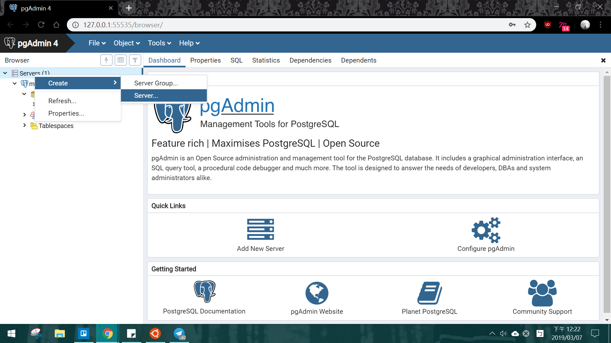
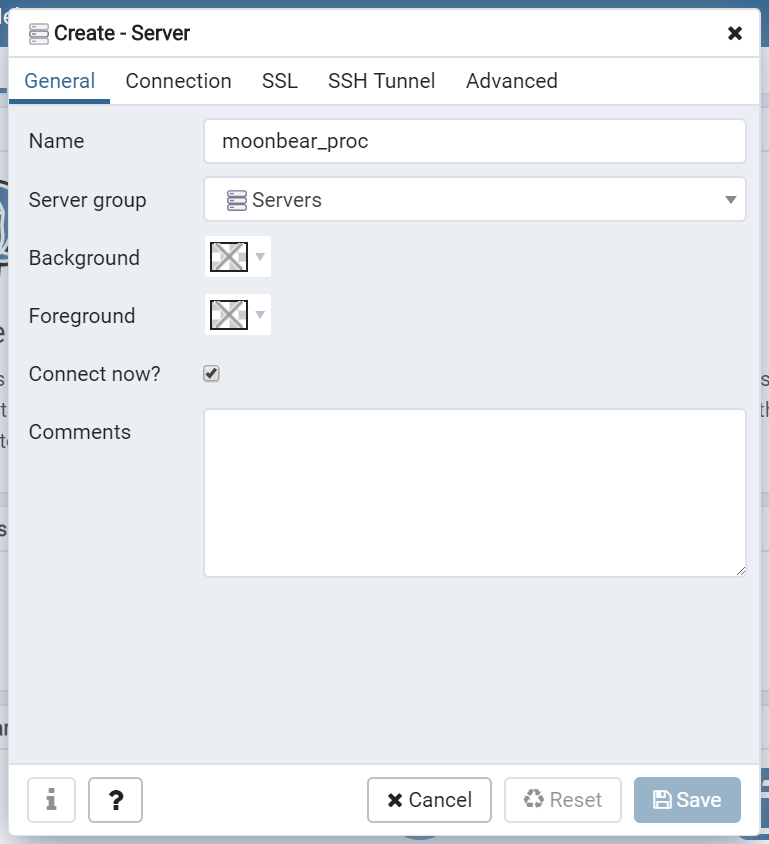
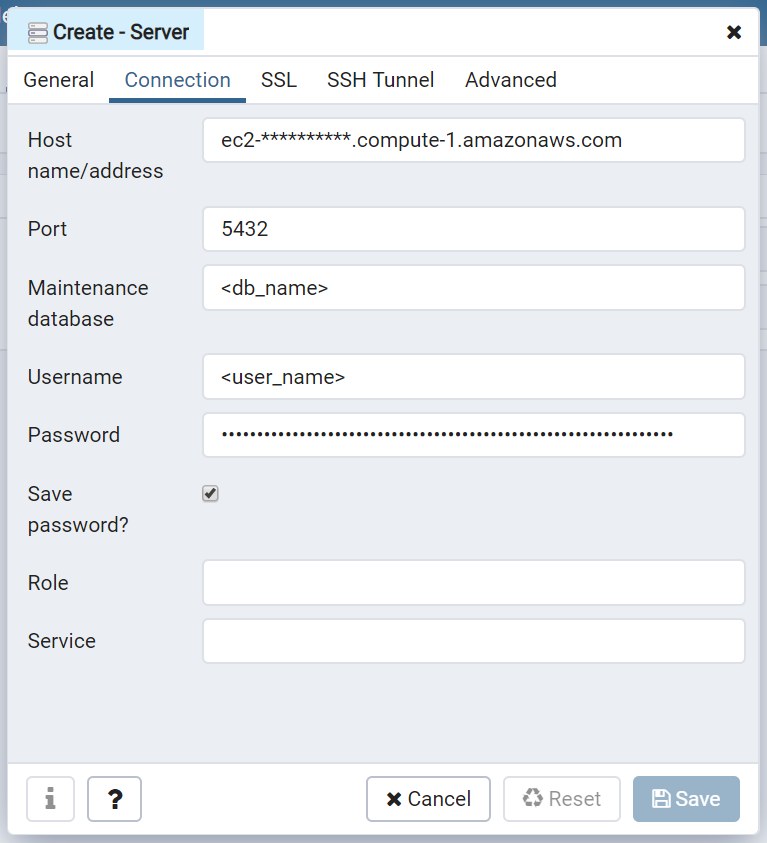
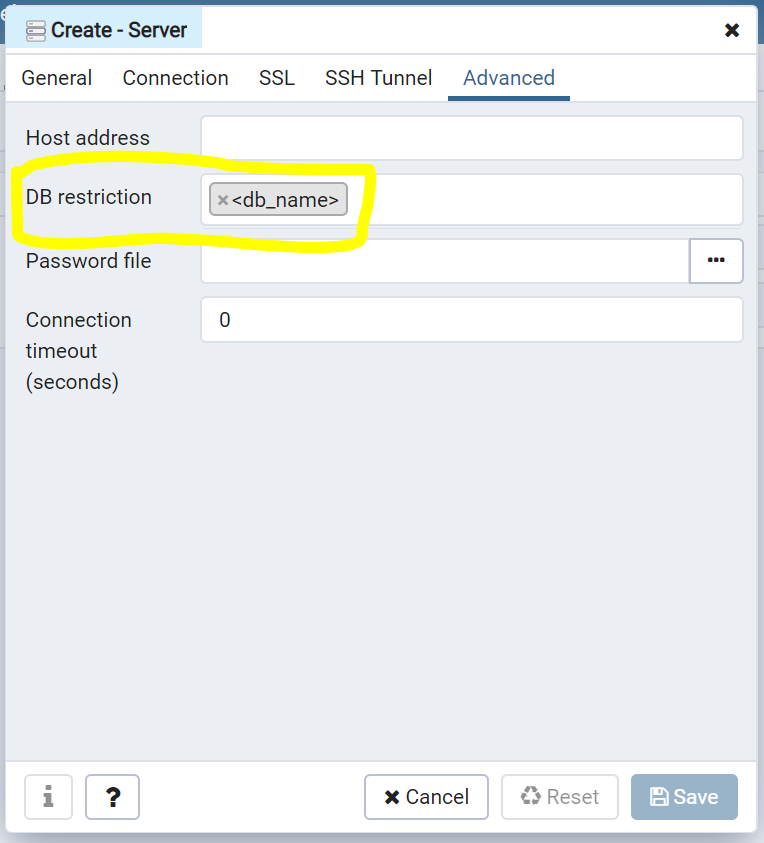
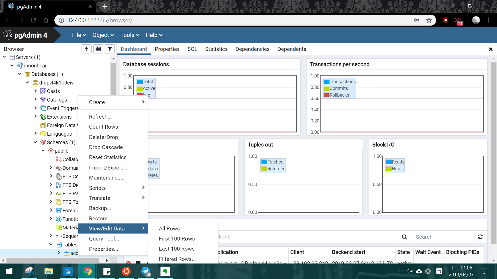

# pgAdmin Remote Connection (Heroku) 
## pgAdmin Remote Connection
### Step1: Download pgAdmin from official website 
[PostgreSQL: Downloads](https://www.postgresql.org/download/)
### Step2: Get Postgres credentials
* Method1: Check Postgres url in heroku config vars
`postgres://<user_name>:<password>@<host_name>:<port>/<db_name>`
* Method2: Get from heroku comend
```
$ heroku pg:credentials:url HEROKU_POSTGRESQL_AQUA_URL
```

### Step3: Using pgAdmin GUI to connect remote server
* Right click on **Servers** → **Create**→ **Server**


* **General**: Name whatever you want


* **Connection**: Fill with credentials


* **SSL**: set SSL mode to ‘Require’


* **Advance**: Restrict DBs to the DBs you care (or it will list tons of DBs that you don’t have permission)



## View/Edit data in pgAdmin

Schemas-public-Tables: Right-click on the table


