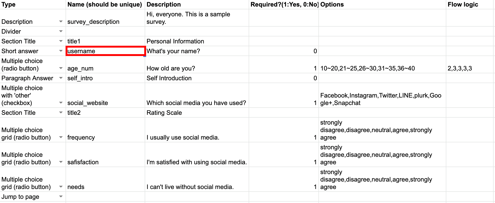
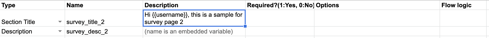
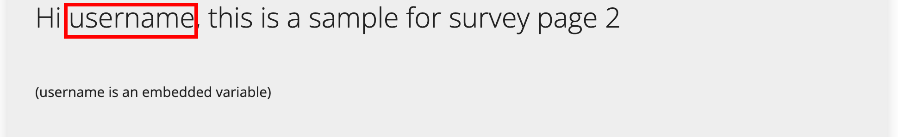
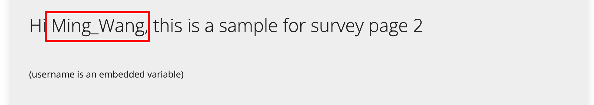

# Embedded Variable
## How to add an embedded variable
Use `{{}}` with `question name` you set in the previous spreadsheet `Name (should be unique)` column in the `Description` column eg. `{{username}}`

- On Page 1, there is a `username` under the `Name (should be unique)` column (red square)

    

- On Page 2, use `{{username}}` in the `Description` column

    

- Input

    

- Preview Mode
    
    

- Start Mode

    

## Notes
1. Supported Question Type
    - Only support **input question type** eg. Short answer, Paragraph Answer, Multiple choice, Random code
    - Not support **non-input question type** eg. Section Title, Description, Divider
2. Undefined Variable
    - If the the `question name` (`{{question_name}}`) is undefined, it will print `undefined`.
3. Preview and Start Mode
    - On preview mode, it shows the `question name`, eg. username, not the really input answer.
    - On preview mode, it can not detect defined/undefined variable because it is still under editing.
4. Limitation
    - It cannot directly show `{{}}` as character
