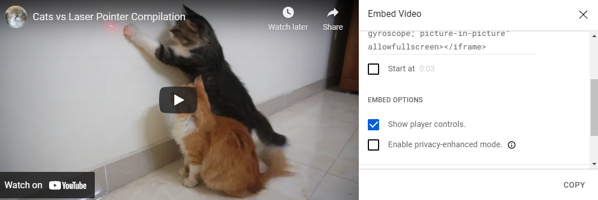
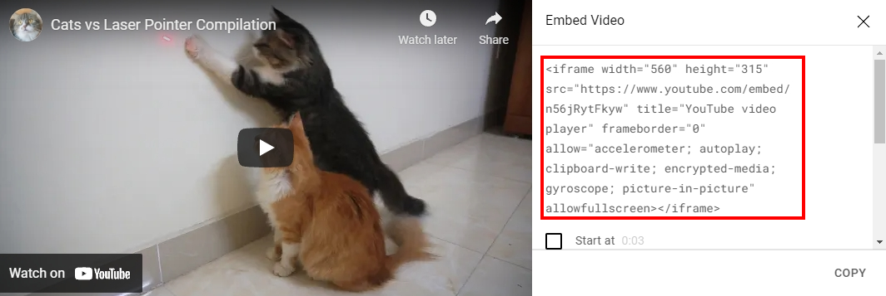
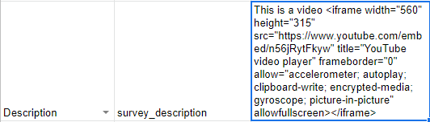

# How to Insert a Video
## Step1 - Copy Youtube embed link
1. Click Share Button


1. Click Embed Button


1. Customize Your Video Setting



1. Copy the iframe code




## Step2 - Paste iframe code to Sheets
**Sheets**



**Result**


## Optional - Customize iframe code
**you can skip and use default**

```
<iframe 
width="560" height="315" 
src="https://www.youtube.com/embed/n56jRytFkyw"  //DO NOT CHANGE
title="YouTube video player"
frameborder="0"
allow="accelerometer; autoplay; clipboard-write; 
encrypted-media; gyroscope; picture-in-picture" 
allowfullscreen>
</iframe>
```

| Attribute | Caption | 
| -------- | -------- | 
| width & height   | set size of video |
| src  | DO NOT CHANGE |
| title  | title |
| frameborder  | set border of frame |
| allow  | allow watcher to change something *Options: accelerometer; autoplay; clipboard-write; encrypted-media; gyroscope; picture-in-picture* |
| allowfullscreen  | allow watcher watch in full screen |
