# Question Types
Website Link: [SurveyMoonbear](https://moonbear.herokuapp.com)

1. Individual Questions
    -  Short answer
    -  Paragraph Answer
    -  Multiple choice
        - Multiple choice (radio button)
        - Multiple choice with 'other' (radio button)
        - Multiple choice (checkbox) 
        - Multiple choice with 'other' (checkbox)
2. Group Questions (Multiple Choice Grid)
    - Multiple choice grid (radio button)
    - Multiple choice grid (slider)
    - Multiple choice grid (VAS)
3. Survey Logic
    - Flow logic
    - Jump to page
4. Other Types
    - Section Title
    - Description
    - Divider
    - Random code

## 1. Individual Questions
### Short answer

### Paragraph Answer
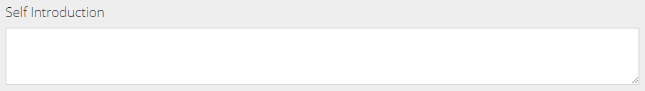

### Multiple choice
#### Multiple choice (radio button)

#### Multiple choice with 'other' (radio button)
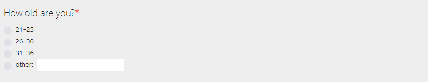
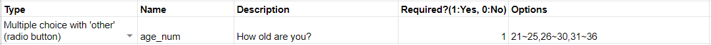

#### Multiple choice (checkbox) 
*multiple selection*

#### Multiple choice with 'other' (checkbox)
*multiple selection*

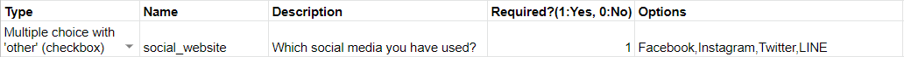

## 2. Group Questions (Multiple Choice Grid)
### Multiple choice grid (radio button)
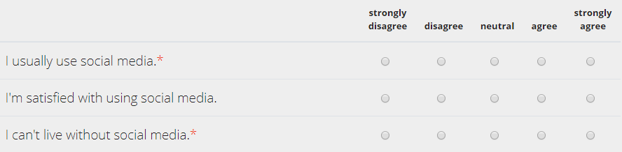

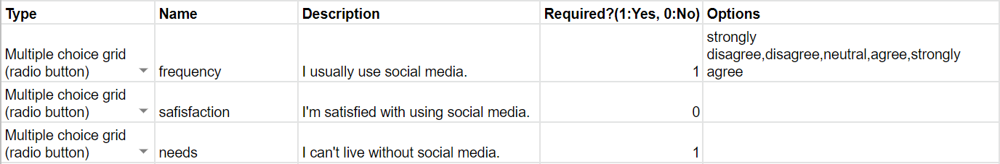

### Multiple choice grid (slider)
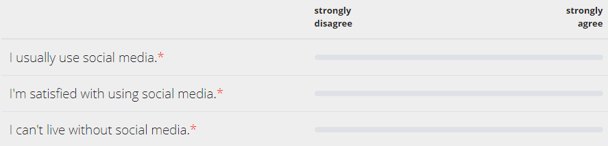

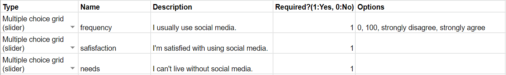

### Multiple choice grid (VAS)
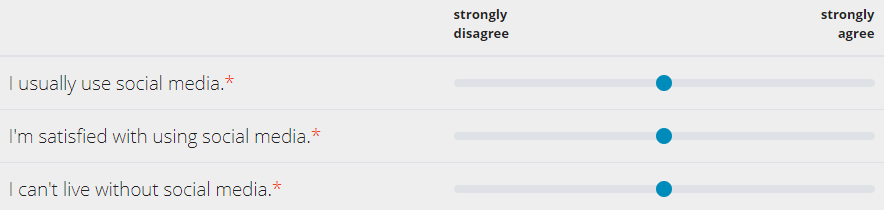

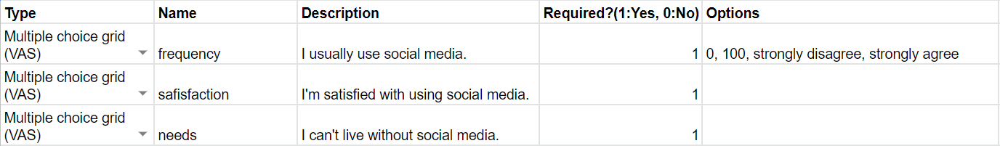

## 3. Survey Logic
This feature only can be shown on **start** mode. In preview mode, it will not show the logic.
### Flow logic
In **Flow logic** column, List the pages to link to according to the choice of the multiple-choice question
Only support on two types of question: _Multiple choice (radio button)_ and _Multiple choice with 'other' (radio button)_
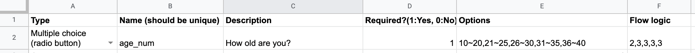

### Jump to page
Insert this item below all the questions
After respondent click next page, it will jump to the page you put in the **Options** column
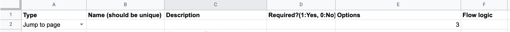

## 4. Other Types
- Section Title
- Description
- Divider
- Random code

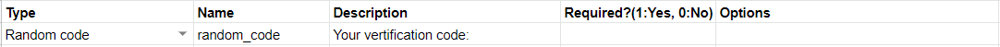
