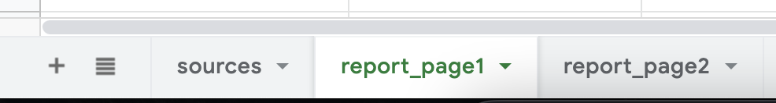
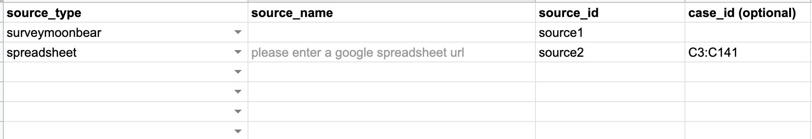
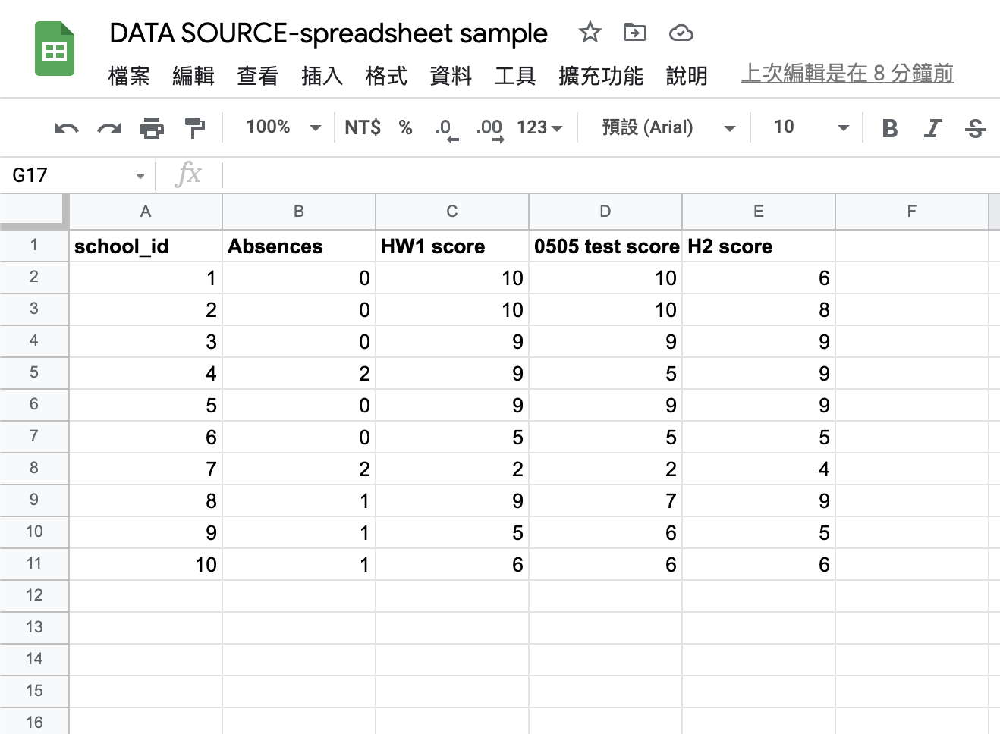
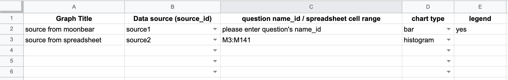
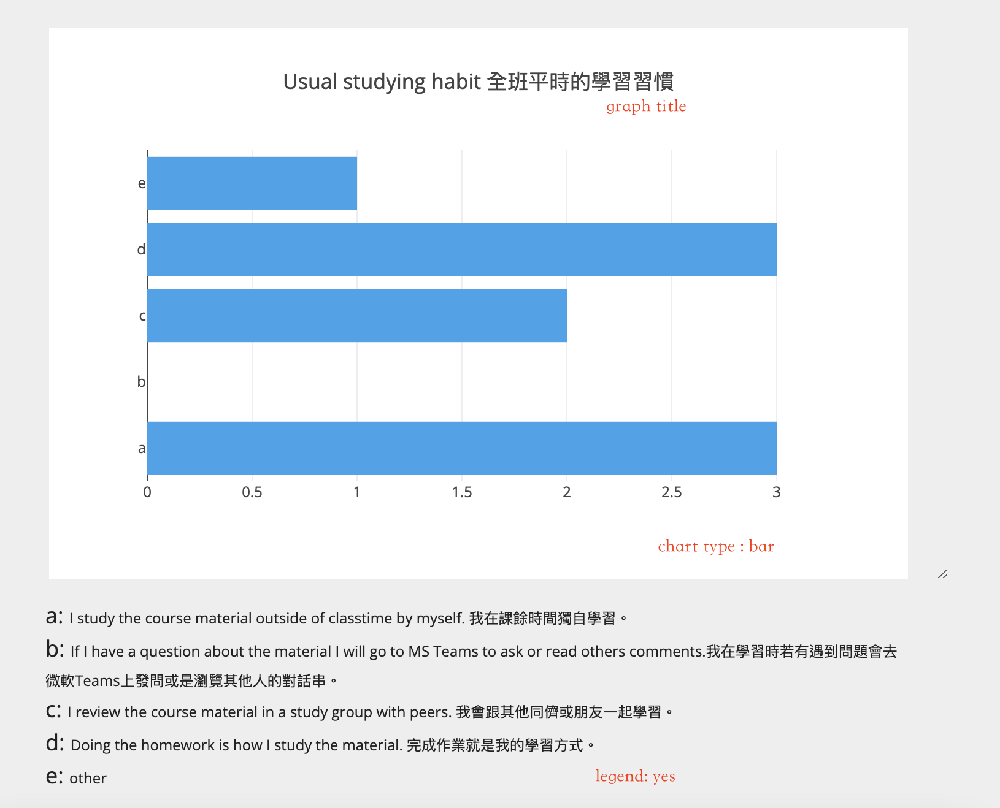
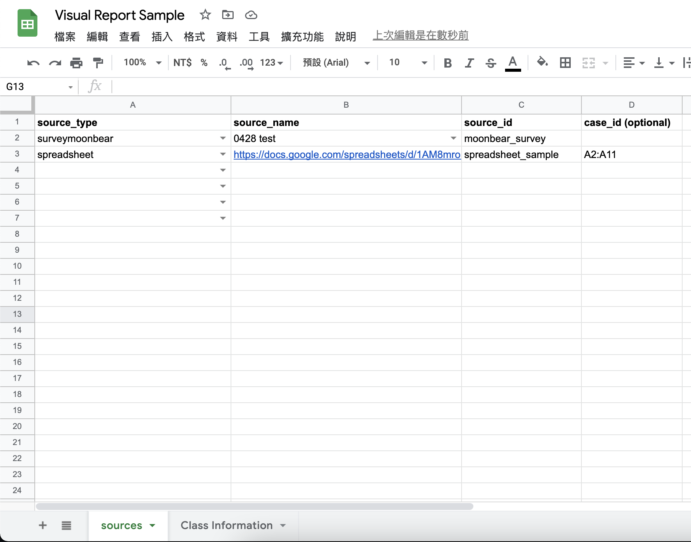
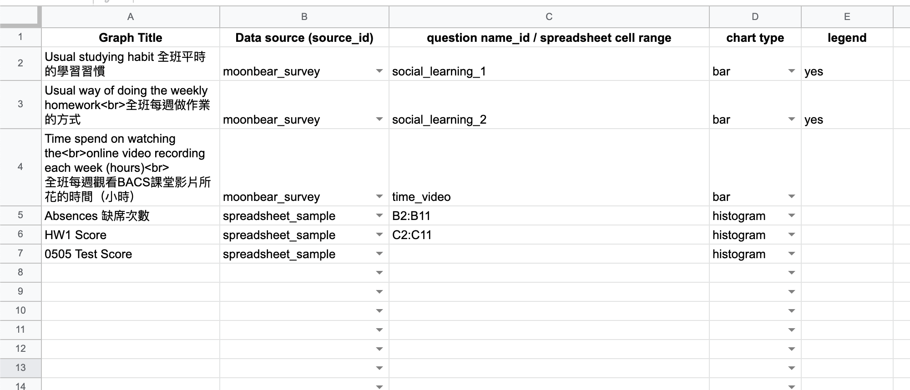
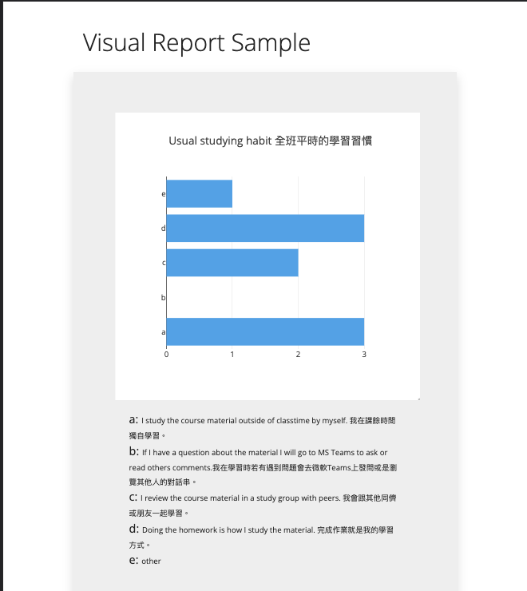
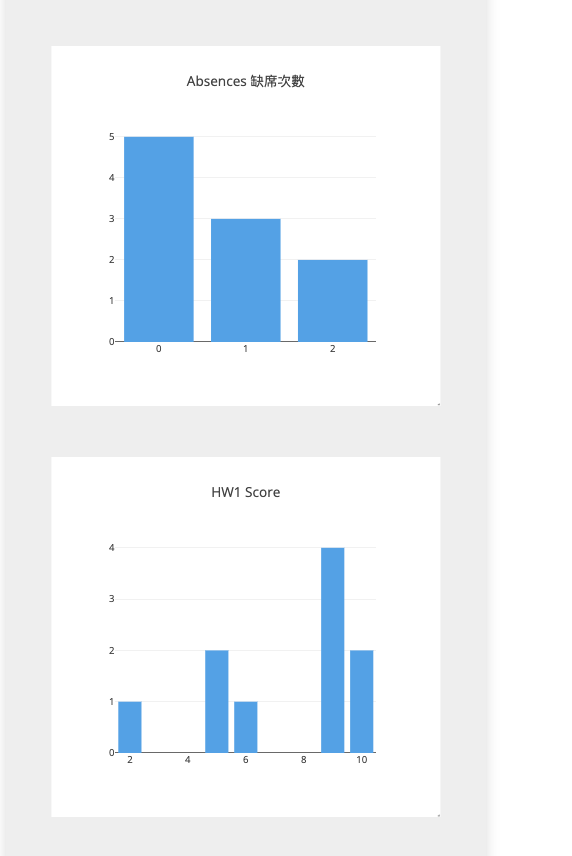

# User Guide - SurveyMoonbear Visual Report
## Intro
- Visual Report could help to count the number of responses of the respondents to the questionnaire. The following question types are currently supported：
    - Multiple choice
        - Multiple choice (radio button)
        - Multiple choice with 'other' (radio button)
        - Multiple choice (checkbox)
        - Multiple choice with 'other' (checkbox)
    - Group Questions (Multiple Choice Grid)
        - Multiple choice grid (radio button)
- Visual Report help you count the occurrences of each element on google spreadsheet.
- 
## Sheets
It consists of one source sheet and multiple report page sheets.
- The first sheet `sources` will define your sources (please don't move it)
- Other sheets (also called `report page sheet`) will define the content of your report. ＩIf there are n sheets, which means that your report will have n pages. (In belowing picture, there are 2 `report page sheet`)

### sources sheet

#### source_type
Two data sources are currently supported:
1. Survey published by SurveyMoonbear
2. google spreadsheet
#### source_name
- If `source_type` is surveymoonbear, `source_name` will have a drop-down menu containing the title of your survey on SurveyMoonbear
- If `source_type` is spreadsheet, please paste the shared link of the spreadsheet in `source_name` (at least have view permission)
#### source_id
Feel free to use an alias for your source, this alias will be used in the following report page sheet.
#### case_id
We expect `case_id` to help create visual reports for different respondents, which is currently under development. 
`case_id` only supports when `source_type` is spreadsheet, and you must enter a range of spreadsheet, as shown in the figure below is A2:A11, and the content of this range can be student ID, ID number, etc. according to your situation.

### report page sheet
- Can have multiple report page sheets
- One row represents one graph (There are two graphs as shown in the belowing picture)

#### Graph Title
Please enter the title of the picture yourself
#### Data source(source_id)
This field defines the source of data for this graph, which is the same as the `source_id` defined by the `sources` sheet
#### question name_id / spreadsheet cell range
- If `source_type` is surveymoonbear, you must enter the question name_id of that survey (please check from your survey spreadsheet)
- If `source_type` is spreadsheet, please enter the cell range of the spreadsheet, such as M3:M14
#### chart type
Currently supports three kinds of charts: bar, line, histogram.
#### legend
If you need legend, please enter yes, then we will alphabetize your label. If not, please keep the empty value.

## Example
### spreadsheet that edit your visual report
one data source is from surveymoonbear; one is from other google spreadsheet (next part will show you what is this google spreadsheet looks like)

### Other spreadsheet as data source

### Result (I will replace these pictures with a link in future)

